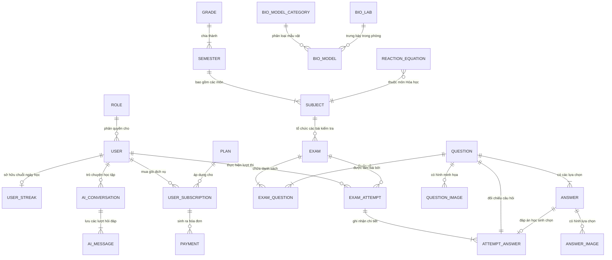
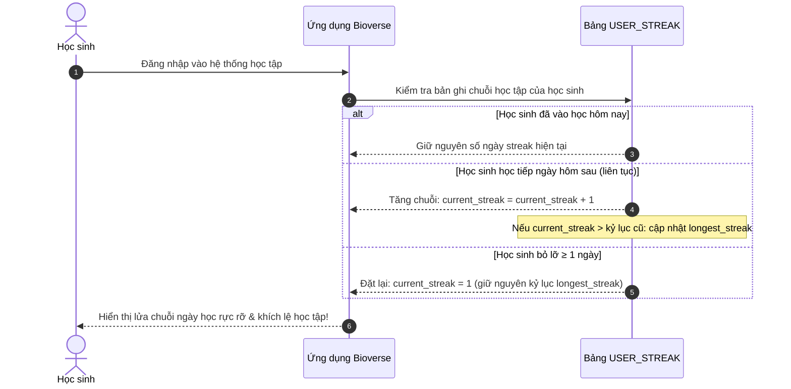
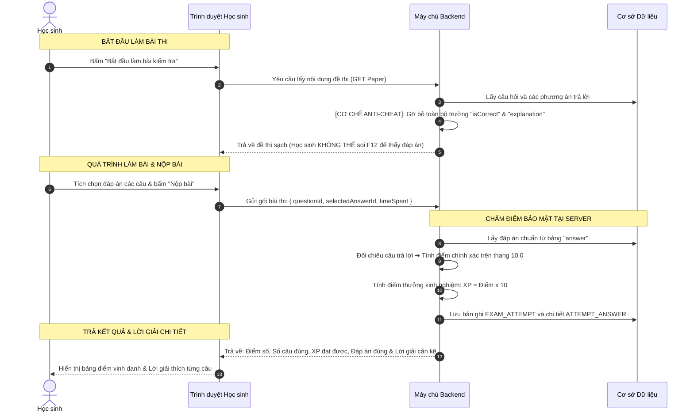
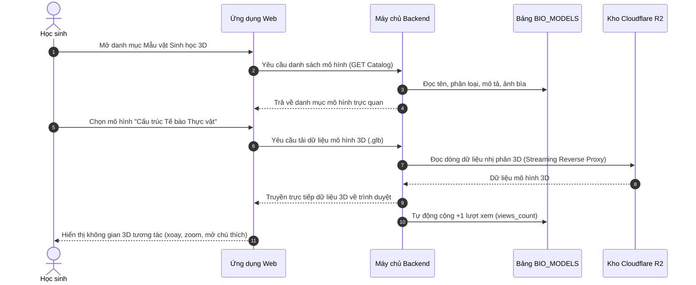

# TÀI LIỆU THIẾT KẾ CƠ SỞ DỮ LIỆU MỨC KHÁI NIỆM (CONCEPTUAL DATABASE DESIGN)
## NỀN TẢNG HỌC TẬP KHOA HỌC TỰ NHIÊN 3D BIOVERSE

> **Dành cho:** Khách hàng, Đối tác Giáo dục, Ban Quản trị & Các bên liên quan (Stakeholders)  
> **Phiên bản tài liệu:** 1.0  
> **Ngôn ngữ trình bày:** Tiếng Việt (kèm thuật ngữ chuẩn quốc tế)  
> **Phạm vi hệ thống:** Toàn bộ dữ liệu của nền tảng Bioverse (PostgreSQL, Cloudflare R2, Redis, Firebase Firestore)

---

## MỤC LỤC
1. [Giới thiệu & Mục tiêu thiết kế](#1-giới-thiệu--mục-tiêu-thiết-kế)
2. [Bức tranh tổng thể: Kiến trúc Dữ liệu Đa tầng (Tiered Storage Architecture)](#2-bức-tranh-tổng-thể-kiến-trúc-dữ-liệu-đa-tầng)
3. [Sơ đồ Thực thể - Mối quan hệ mức Khái niệm (Conceptual ERD)](#3-sơ-đồ-thực-thể---mối-quan-hệ-mức-khái-niệm-conceptual-erd)
4. [Chi tiết các Phân hệ Dữ liệu Nghiệp vụ (Data Domains)](#4-chi-tiết-các-phân-hệ-dữ-liệu-nghiệp-vụ-data-domains)
   - [4.1. Phân hệ Người dùng, Phân quyền & Điểm danh (User & Gamification)](#41-phân-hệ-người-dùng-phân-quyền--điểm-danh-user--gamification)
   - [4.2. Phân hệ Phân cấp Chương trình Học & Khảo thí (Curriculum & Exam Taxonomy)](#42-phân-hệ-phân-cấp-chương-trình-học--khảo-thí-curriculum--exam-taxonomy)
   - [4.3. Phân hệ Nhật ký Thi cử & Cơ chế Chống gian lận (Examination & Anti-Cheat)](#43-phân-hệ-nhật-ký-thi-cử--cơ-chế-chống-gian-lận-examination--anti-cheat)
   - [4.4. Phân hệ Kho Mô hình 3D, Phòng Lab & Mô phỏng Hóa học (3D Models & Simulation)](#44-phân-hệ-kho-mô-hình-3d-phòng-lab--mô-phỏng-hóa-học-3d-models--simulation)
   - [4.5. Phân hệ Gói Dịch vụ & Doanh thu (Subscription & Commercial)](#45-phân-hệ-gói-dịch-vụ--doanh-thu-subscription--commercial)
   - [4.6. Phân hệ Trí tuệ Nhân tạo & Lịch sử Hội thoại (AI Tutor Conversations)](#46-phân-hệ-trí-tuệ-nhân-tạo--lịch-sử-hội-thoại-ai-tutor-conversations)
5. [Các Mối quan hệ Nghiệp vụ Cốt lõi (Business Relationships)](#5-các-mối-quan-hệ-nghiệp-vụ-cốt-lõi-business-relationships)
6. [Quy trình Luân chuyển Dữ liệu Điển hình (Data Lifecycles)](#6-quy-trình-luân-chuyển-dữ-liệu-điển-hình-data-lifecycles)
   - [Luồng 1: Học sinh học tập & Tích lũy chuỗi ngày học (Daily Streak)](#luồng-1-học-sinh-học-tập--tích-lũy-chuỗi-ngày-học-daily-streak)
   - [Luồng 2: Quy trình Khảo thí An toàn (Phát đề ➔ Chấm điểm Server ➔ Thưởng XP)](#luồng-2-quy-trình-khảo-thí-an-toàn-phát-đề--chấm-điểm-server--thưởng-xp)
   - [Luồng 3: Khám phá Mô hình Sinh học & Phòng Thí nghiệm Hóa học ảo 3D](#luồng-3-khám-phá-mô-hình-sinh-học--phòng-thí-nghiệm-hóa-học-ảo-3d)
7. [Cam kết An toàn, Bảo mật & Toàn vẹn Dữ liệu cho Học đường](#7-cam-kết-an-toàn-bảo-mật--toàn-vẹn-dữ-liệu-cho-học-đường)
8. [Tổng kết Giá trị Doanh nghiệp (Business Values)](#8-tổng-kết-giá-trị-doanh-nghiệp-business-values)

---

## 1. Giới thiệu & Mục tiêu thiết kế

Tài liệu này được xây dựng nhằm mục đích giải thích cấu trúc cơ sở dữ liệu của nền tảng **Bioverse** ở **Mức Khái niệm (Conceptual Level)**. 

Khác với tài liệu kỹ thuật vật lý (Physical Schema chứa các dòng lệnh SQL phức tạp hay ràng buộc kiểu dữ liệu máy tính), tài liệu này tập trung trả lời 3 câu hỏi lớn của quý khách hàng và các nhà quản lý:
1. **Hệ thống đang lưu trữ những thông tin gì?** (Các thực thể kinh doanh và giáo dục).
2. **Tại sao lại cần lưu trữ thông tin đó và ý nghĩa của chúng là gì?** (Giá trị thực tế đối với nhà trường, giáo viên và học sinh THCS).
3. **Các nhóm dữ liệu liên kết với nhau như thế nào để tạo nên trải nghiệm học tập thông minh, an toàn và hấp dẫn?**

### Triết lý thiết kế dữ liệu của Bioverse
* **Lấy học sinh làm trung tâm (Student-Centric):** Dữ liệu được tổ chức chặt chẽ theo từng Khối lớp (Lớp 6, 7, 8, 9) và Môn học (Khoa học Tự nhiên: Sinh, Lý, Hóa) đúng theo chuẩn chương trình Giáo dục Phổ thông hiện hành.
* **Bảo mật và Công bằng (Integrity & Anti-Cheat):** Dữ liệu đề thi, đáp án và kết quả làm bài được thiết kế độc lập nhằm bảo đảm tuyệt đối tính khách quan, chống gian lận kỹ thuật số (F12 / DevTools).
* **Trực quan & Hiện đại (Visual-First):** Hỗ trợ lưu trữ siêu dữ liệu mô hình không gian 3 chiều và tọa độ hoạt cảnh phân tử động (.chemx).
* **Tối ưu hóa hiệu năng & Chi phí (High Performance & Cost Efficiency):** Phân chia dữ liệu theo tầng lưu trữ phù hợp (dữ liệu giao dịch, dữ liệu đệm tạm, tệp đa phương tiện nặng và dữ liệu hội thoại AI).

---

## 2. Bức tranh tổng thể: Kiến trúc Dữ liệu Đa tầng

Để mang lại tốc độ phản hồi tính bằng mili-giây và tiết kiệm chi phí hạ tầng máy chủ cho khách hàng, Bioverse không dồn toàn bộ dữ liệu vào một kho duy nhất mà áp dụng **Mô hình Dữ liệu Đa tầng (Tiered Storage)** hiện đại:

```mermaid
flowchart TB
    subgraph Client["Trải nghiệm Người dùng (Web Browser & Mobile)"]
        UI["Giao diện Học sinh / Giáo viên / Quản trị viên"]
    end

    subgraph DataArchitecture["Kiến trúc Lưu trữ Dữ liệu Phân tầng Bioverse"]
        subgraph Postgres["1. Cơ sở Dữ liệu Cốt lõi (PostgreSQL 16)"]
            direction TB
            D1["Tài khoản, Hồ sơ & Vai trò"]
            D2["Ngân hàng Đề thi, Câu hỏi & Đáp án"]
            D3["Nhật ký Thi & Điểm số Học sinh"]
            D4["Danh mục Mẫu vật 3D & Hoạt cảnh Hóa học"]
            D5["Chuỗi ngày học liên tục (Streak) & Gói cước"]
        end

        subgraph RedisCache["2. Tầng Bộ nhớ Tạm Tốc độ cao (Redis 7)"]
            direction TB
            R1["Mã xác thực OTP qua Email (TTL 10 phút)"]
            R2["Chống gửi liên tục (Cooldown 60s)"]
            R3["Thu hồi phiên đăng nhập (Token Blacklist)"]
        end

        subgraph CloudflareR2["3. Kho Tệp Đa phương tiện Đám mây (Cloudflare R2)"]
            direction TB
            C1["Tệp Mô hình 3D (.glb, .gltf, textures)"]
            C2["Ảnh minh họa câu hỏi & bài giảng"]
            C3["Ảnh đại diện & Thumbnail mẫu vật"]
        end

        subgraph FirebaseFirestore["4. Kho Hội thoại Trí tuệ Nhân tạo (Firebase Firestore)"]
            direction TB
            F1["Lịch sử Trò chuyện với Gia sư AI"]
            F2["Ngữ cảnh học tập từng học sinh (8 tin gần nhất)"]
        end
    end

    UI -->|"Giao dịch nghiệp vụ & Khảo thí"| Postgres
    UI -->|"Xác thực nhanh & Đăng xuất tức thì"| RedisCache
    UI -->|"Tải ảnh & Stream mô hình 3D không độ trễ"| CloudflareR2
    UI -->|"Hỏi đáp học tập thông minh"| FirebaseFirestore
```



### Ý nghĩa thực tế cho Khách hàng:
1. **PostgreSQL (Trọng tâm nghiệp vụ):** Đảm bảo dữ liệu điểm số, tài khoản và đề thi **không bao giờ bị sai sót, mất mát** (chuẩn ACID khắt khe).
2. **Redis (An toàn & Tốc độ):** Giúp hệ thống chống nghẽn mạng khi hàng nghìn học sinh cùng đăng nhập hoặc yêu cầu gửi mã OTP vào đầu giờ học.
3. **Cloudflare R2 (Lưu trữ tệp 3D không giới hạn):** Các tệp 3D dung lượng lớn (5MB - 50MB) được phân phối qua mạng lưới toàn cầu, giúp học sinh mở bài học 3D nhanh như xem video mà **không làm nghẽn đường truyền máy chủ chính**.
4. **Firebase Firestore (Linh hoạt cho AI):** Lưu trữ hàng triệu đoạn đối thoại giữa học sinh và Trợ lý AI một cách mượt mà mà không làm phình to cơ sở dữ liệu học tập chính.

---

## 3. Sơ đồ Thực thể - Mối quan hệ mức Khái niệm (Conceptual ERD)

Dưới đây là sơ đồ mô tả các thực thể dữ liệu chính và cách chúng liên kết với nhau trong toàn bộ hệ thống Bioverse:



---

## 4. Chi tiết các Phân hệ Dữ liệu Nghiệp vụ (Data Domains)

### 4.1. Phân hệ Người dùng, Phân quyền & Điểm danh (User & Gamification)

Phân hệ này quản lý danh tính, phân quyền và động lực học tập của người dùng trên hệ thống.

```
┌─────────────────┐       1 : N       ┌─────────────────┐
│      ROLE       │ ────────────────> │      USER       │
│  (Vai trò quyền)│                   │   (Người dùng)  │
└─────────────────┘                   └────────┬────────┘
                                               │ 1 : 1
                                               ▼
                                      ┌─────────────────┐
                                      │   USER_STREAK   │
                                      │ (Chuỗi ngày học)│
                                      └─────────────────┘
```

#### 1. Thực thể `USER` (Người dùng / Học sinh)
* **Ý nghĩa nghiệp vụ:** Đại diện cho mỗi cá nhân tham gia vào nền tảng (học sinh THCS, giáo viên hoặc quản trị viên nhà trường).
* **Các thông tin cốt lõi:**
  * *Họ và tên, Email, Số điện thoại:* Định danh và liên lạc.
  * *Mật khẩu mã hóa (BCrypt):* Bảo mật tuyệt đối, ngay cả quản trị viên cũng không thể đọc được mật khẩu gốc.
  * *Khối lớp (`grade`):* Xác định học sinh đang học lớp 6, 7, 8 hay 9 để hệ thống tự động gợi ý đề thi, mô hình 3D phù hợp với độ tuổi.
  * *Ngày sinh, Giới tính, Ảnh đại diện:* Cá nhân hóa hồ sơ người học.
  * *Trạng thái tài khoản (`ACTIVE`, `LOCKED`):* Giúp ban quản lý nhà trường khóa tài khoản khi có vi phạm hoặc học sinh chuyển trường.

#### 2. Thực thể `ROLE` (Vai trò & Quyền hạn)
* **Ý nghĩa nghiệp vụ:** Thiết lập hàng rào phân quyền chặt chẽ trong nhà trường.
* **Các vai trò tiêu chuẩn:**
  * `STUDENT` (Học sinh): Chỉ được xem bài học, làm bài tập, chat với AI, không thể can thiệp chỉnh sửa đề thi hay xem đáp án bài thi trước khi nộp.
  * `ADMIN` (Quản trị viên / Giáo viên): Quản lý kho đề thi, tải mô hình 3D, theo dõi thống kê học sinh, duyệt tài khoản.

#### 3. Thực thể `USER_STREAK` (Chuỗi Ngày Học Liên Tục - Gamification)
* **Ý nghĩa nghiệp vụ:** Ứng dụng kỹ thuật trò chơi hóa (Gamification) để xây dựng thói quen tự giác học tập mỗi ngày cho học sinh.
* **Các chỉ số theo dõi:**
  * *Chuỗi ngày hiện tại (`current_streak`):* Số ngày học sinh đăng nhập và học tập liên tục (tính theo giờ Việt Nam).
  * *Kỷ lục chuỗi dài nhất (`longest_streak`):* Thành tích cao nhất của học sinh để trao huy hiệu thi đua.
  * *Ngày điểm danh gần nhất (`last_check_in_date`):* Đánh giá tính liên tục. Nếu học sinh bỏ lỡ quá 1 ngày, chuỗi sẽ tự động tính lại từ 1 nhằm khích lệ tính kiên trì.

---

### 4.2. Phân hệ Phân cấp Chương trình Học & Khảo thí (Curriculum & Exam Taxonomy)

Phân hệ này mô phỏng chính xác cấu trúc chương trình Giáo dục Phổ thông của Bộ Giáo dục & Đào tạo, giúp học sinh dễ dàng tìm kiếm bài thi đúng theo tiến độ trên lớp.

```
┌──────────────┐     1 : N     ┌──────────────┐     1 : N     ┌──────────────┐
│    GRADE     │ ────────────> │   SEMESTER   │ ────────────> │   SUBJECT    │
│  (Khối lớp)  │               │   (Học kỳ)   │               │   (Môn học)  │
└──────────────┘               └──────────────┘               └──────┬───────┘
                                                                     │ 1 : N
                                                                     ▼
                                                              ┌──────────────┐
                                                              │     EXAM     │
                                                              │   (Đề thi)   │
                                                              └──────┬───────┘
                                                                     │ 1 : N
                                                                     ▼
┌──────────────┐     N : 1     ┌──────────────┐     1 : N     ┌──────────────┐
│    ANSWER    │ <──────────── │   QUESTION   │ <──────────── │EXAM_QUESTION │
│  (Các đáp án)│               │  (Câu hỏi)   │               │ (Bảng ghép đề)
└──────────────┘               └──────────────┘               └──────────────┘
```

#### 1. Thực thể `GRADE` (Khối lớp)
* **Ý nghĩa:** Quản lý 4 khối lớp cấp THCS: Lớp 6, Lớp 7, Lớp 8, Lớp 9.

#### 2. Thực thể `SEMESTER` (Học kỳ)
* **Ý nghĩa:** Phân bổ chương trình theo Học kỳ 1 và Học kỳ 2 nhằm phục vụ các kỳ thi Giữa kỳ và Cuối kỳ.

#### 3. Thực thể `SUBJECT` (Môn học)
* **Ý nghĩa:** Môn Khoa học Tự nhiên (tích hợp các phân môn Vật lý, Hóa học, Sinh học).

#### 4. Thực thể `EXAM` (Đề thi / Bài kiểm tra)
* **Ý nghĩa nghiệp vụ:** Gói đề thi hoàn chỉnh dành cho học sinh ôn luyện hoặc thi chính thức.
* **Thông tin quan trọng:** Mã đề (`code`), Tên bài thi (`name`), Thời gian làm bài (`duration_minutes` - ví dụ: 45 phút, 15 phút), Điểm tối đa (`total_score` - chuẩn thang 10.0), Trạng thái đóng/mở đề (`is_active`).

#### 5. Thực thể `QUESTION` & `ANSWER` (Ngân hàng Câu hỏi & Đáp án)
* **Ý nghĩa nghiệp vụ:** Kho câu hỏi dùng chung (Item Bank). Một câu hỏi có thể được tái sử dụng trong nhiều đề thi khác nhau.
* **Đặc điểm nổi bật:**
  * Hỗ trợ trắc nghiệm 1 đáp án đúng (`SINGLE_CHOICE`) và nhiều đáp án đúng (`MULTIPLE_CHOICE`).
  * Có phần **Lời giải thích chi tiết (`explanation`)**: Giúp học sinh hiểu tường tận lý do tại sao đúng/sai sau khi hoàn thành bài thi.
  * Tích hợp hình ảnh minh họa cho cả câu hỏi (`QUESTION_IMAGE`) và từng lựa chọn đáp án (`ANSWER_IMAGE`).

#### 6. Thực thể `EXAM_QUESTION` (Cấu trúc Đề thi)
* **Ý nghĩa nghiệp vụ:** Bảng liên kết linh hoạt cho phép người biên soạn đề:
  * Sắp xếp thứ tự hiển thị câu hỏi (Câu 1, Câu 2, Câu 3...).
  * Phân bổ trọng số điểm cho từng câu (ví dụ câu dễ 0.25 điểm, câu vận dụng cao 0.5 điểm).

---

### 4.3. Phân hệ Nhật ký Thi cử & Cơ chế Chống gian lận (Examination & Anti-Cheat)

Đây là phân hệ bảo đảm tính **toàn vẹn và trung thực** trong quá trình kiểm tra đánh giá của học sinh.

```
┌──────────────┐                    ┌──────────────┐
│     USER     │                    │     EXAM     │
│  (Học sinh)  │                    │   (Đề thi)   │
└──────┬───────┘                    └──────┬───────┘
       │ 1                                 │ 1
       │                                   │
       └─────────────────┬─────────────────┘
                         │ N
                         ▼
              ┌─────────────────────┐
              │    EXAM_ATTEMPT     │
              │  (Lượt nộp bài thi) │
              └──────────┬──────────┘
                         │ 1 : N
                         ▼
              ┌─────────────────────┐
              │   ATTEMPT_ANSWER    │
              │(Chi tiết từng câu)  │
              └─────────────────────┘
```

#### 1. Thực thể `EXAM_ATTEMPT` (Lượt làm bài thi)
* **Ý nghĩa nghiệp vụ:** Lưu lại toàn bộ lịch sử mỗi lần học sinh thực hiện một bài thi.
* **Thông số giám sát:**
  * *Thời điểm bắt đầu (`started_at`) & Thời điểm nộp bài (`submitted_at`):* Xác minh học sinh làm bài trong bao lâu.
  * *Tổng thời gian làm bài (`time_spent_sec`):* Đo lường mức độ thuần thục bài học của học sinh.
  * *Điểm số (`score`):* Điểm số chuẩn xác được máy chủ chấm tự động (thang điểm 10.0).
  * *Số câu đúng (`correct_count`) / Tổng số câu (`total_questions`):* Tỷ lệ hoàn thành.

#### 2. Thực thể `ATTEMPT_ANSWER` (Bảng ghi vết câu trả lời)
* **Ý nghĩa nghiệp vụ:** Lưu vết chi tiết từng câu hỏi trong bài làm:
  * Học sinh đã chọn đáp án nào (`selected_answer_id`)?
  * Câu trả lời đó đúng hay sai (`is_correct`)?
  * Thời gian học sinh dừng lại suy nghĩ ở câu hỏi đó (`time_spent_sec`).
* **Giá trị sư phạm:** Giáo viên có thể xem biểu đồ phân tích để biết học sinh đang gặp khó khăn ở dạng kiến thức nào (dừng lại quá lâu hoặc trả lời sai hàng loạt).

---

### 4.4. Phân hệ Kho Mô hình 3D, Phòng Lab & Mô phỏng Hóa học (3D Models & Simulation)

Điểm nhấn đột phá của Bioverse so với các nền tảng giáo dục truyền thống là khả năng trực quan hóa bài giảng bằng công nghệ không gian 3 chiều.

```
┌────────────────────────┐      1 : N      ┌────────────────────────┐
│  BIO_MODEL_CATEGORY    │ ──────────────> │       BIO_MODEL        │
│   (Danh mục mẫu vật)   │                 │     (Mô hình 3D)       │
└────────────────────────┘                 └────────────────────────┘
                                                       ▲
┌────────────────────────┐                             │ N : 1
│        BIO_LAB         │ ────────────────────────────┘
│  (Phòng thí nghiệm ảo) │
└────────────────────────┘

┌────────────────────────┐
│   REACTION_EQUATION    │ (Mô phỏng phản ứng Hóa học chuyển động phân tử
│ (Phương trình hóa học) │  với kịch bản thời gian thực định dạng .chemx)
└────────────────────────┘
```

#### 1. Thực thể `BIO_MODEL` (Mẫu vật Sinh học & Thiết bị Khoa học 3D)
* **Ý nghĩa nghiệp vụ:** Lưu trữ thông tin tri thức và siêu dữ liệu kỹ thuật của các vật thể 3D (Tế bào nhân thực, Cấu trúc lá cây, Hệ tuần hoàn người, Dụng cụ thí nghiệm...).
* **Dữ liệu sư phạm phong phú:**
  * Tên tiếng Việt, Tên tiếng Anh, Tên danh pháp khoa học La-tinh (`scientific_name`).
  * Môi trường sống (`habitat`), Đặc điểm sinh học (`characteristics`), Phân loại học (`classification` dạng JSON linh hoạt).
  * Sự thật thú vị (`fun_facts`): Kích thích trí tò mò của học sinh.
* **Dữ liệu cấu hình hiển thị 3D:**
  * Đường dẫn tệp 3D (`model_url`) định dạng chuẩn nén quốc tế `.glb` (GL Transmission Format).
  * Tọa độ góc quay mặc định (`default_rotation`), vị trí đặt ống kính (`camera_position`), tỷ lệ phóng to thu nhỏ (`default_scale`).
  * Các điểm chú thích tương tác (`annotations` dạng JSON): Khi học sinh bấm vào từng bộ phận trên mô hình 3D, hệ thống sẽ hiện hộp thông tin giải thích chi tiết.
  * Chỉ số đo lường độ phổ biến (`views_count`), ghim nổi bật trang chủ (`is_featured`).

#### 2. Thực thể `BIO_MODEL_CATEGORY` (Danh mục Phân loại Mẫu vật)
* **Ý nghĩa nghiệp vụ:** Gom nhóm các mô hình theo cây tri thức (ví dụ: Vi sinh vật, Thực vật học, Giải phẫu người, Động vật không xương sống).

#### 3. Thực thể `BIO_LAB` (Phòng Thí nghiệm Ảo 3D)
* **Ý nghĩa nghiệp vụ:** Đại diện cho các không gian thực hành số (ví dụ: Phòng Thí nghiệm Kính hiển vi Quang học, Phòng Thí nghiệm Hóa vô cơ, Phòng Quan sát Hệ sinh thái). Cho phép học sinh di chuyển và thao tác với các thiết bị như ngoài đời thực.

#### 4. Thực thể `REACTION_EQUATION` (Mô phỏng Phản ứng Hóa học Động)
* **Ý nghĩa nghiệp vụ:** Giải quyết bài toán trừu tượng nhất của môn Hóa học: **Nguyên tử và phân tử chuyển động như thế nào khi phản ứng xảy ra?**
* **Dữ liệu kịch bản `.chemx` (`chemx_json`):**
  * Lưu trữ cấu trúc hoạt cảnh theo từng mốc thời gian (Keyframe animation).
  * Định nghĩa vị trí không gian các hạt nguyên tử, các liên kết cộng hóa trị/ion bị bẻ gãy và liên kết mới được hình thành, kèm màu sắc biến đổi của chất phản ứng.
  * Được bảo vệ bởi cờ hệ thống (`is_system`) giúp nội dung giáo khoa luôn chuẩn xác, không bị chỉnh sửa tùy tiện.

---

### 4.5. Phân hệ Gói Dịch vụ & Doanh thu (Subscription & Commercial)

Hỗ trợ mô hình vận hành trường học hoặc kinh doanh thương mại điện tử giáo dục trực tuyến linh hoạt.

```
┌─────────────────┐       1 : N       ┌─────────────────┐       1 : N       ┌─────────────────┐
│      PLAN       │ ────────────────> │  SUBSCRIPTION   │ ────────────────> │     PAYMENT     │
│   (Gói cước)    │                   │(Gói học sinh mua│                   │ (Giao dịch tiền)│
└─────────────────┘                   └─────────────────┘                   └─────────────────┘
```

* **`PLAN` (Gói cước):** Thiết lập các gói dịch vụ linh hoạt: Gói Tháng (30 ngày), Gói Học kỳ (90 ngày), Gói Năm học (365 ngày) kèm danh sách quyền lợi mở rộng.
* **`SUBSCRIPTION` (Hợp đồng thuê bao):** Theo dõi hạn sử dụng dịch vụ của từng tài khoản học sinh, ngày bắt đầu, ngày kết thúc và trạng thái kích hoạt.
* **`PAYMENT` (Giao dịch Thanh toán):** Tích hợp cổng thanh toán tự động (PayOS / Chuyển khoản QR ngân hàng), lưu vết mã giao dịch ngân hàng, số tiền, bằng chứng thanh toán để đối soát minh bạch.

---

### 4.6. Phân hệ Trí tuệ Nhân tạo & Lịch sử Hội thoại (AI Tutor Conversations)

*Lưu trữ trên nền tảng Firebase Firestore giúp truy vấn tức thì và giảm tải cho máy chủ cơ sở dữ liệu chính.*

* **Thực thể `AI_CONVERSATION` (Phiên trao đổi):** Gom nhóm các câu hỏi cùng chủ đề của học sinh (ví dụ: "Hỏi bài quang hợp", "Hỏi bài tập axit tác dụng với bazơ").
* **Thực thể `AI_MESSAGE` (Lượt tin nhắn):** Lưu trữ từng cặp câu hỏi - câu trả lời:
  * Vai trò người gửi (`user` hoặc `assistant`).
  * Nội dung câu hỏi và câu phản hồi sư phạm đã qua bộ lọc an toàn (**AI Guardrails**).
  * Dấu thời gian phục vụ việc ôn tập lại lịch sử hỏi đáp của học sinh.

---

## 5. Các Mối quan hệ Nghiệp vụ Cốt lõi (Business Relationships)

Bảng tổng hợp dưới đây giúp các bên liên quan nắm bắt nhanh sự tương tác giữa các thực thể:

| Thực thể nguồn | Mối quan hệ | Thực thể đích | Diễn giải quy tắc nghiệp vụ đời thực |
| :--- | :---: | :--- | :--- |
| **`ROLE`** | **1 - N** | **`USER`** | Một vai trò được cấp cho nhiều người dùng; mỗi người dùng có một vai trò cụ thể (`STUDENT` hoặc `ADMIN`). |
| **`USER`** | **1 - 1** | **`USER_STREAK`** | Mỗi học sinh sở hữu duy nhất một bảng thành tích chuỗi học tập liên tục theo thời gian thực. |
| **`GRADE`** | **1 - N** | **`SEMESTER`** | Một khối lớp (ví dụ Lớp 8) gồm đúng 2 học kỳ (Học kỳ 1 và Học kỳ 2). |
| **`SEMESTER`** | **1 - N** | **`SUBJECT`** | Mỗi học kỳ có các môn học cụ thể (Khoa học Tự nhiên). |
| **`SUBJECT`** | **1 - N** | **`EXAM`** | Mỗi môn học có nhiều bài kiểm tra, đề thi thử và đề thi học kỳ. |
| **`EXAM`** | **1 - N** | **`EXAM_QUESTION`** | Một đề thi được tạo nên từ nhiều câu hỏi, có quy định rõ điểm số từng câu và thứ tự xuất hiện. |
| **`QUESTION`** | **1 - N** | **`ANSWER`** | Một câu hỏi trắc nghiệm có từ 2 đến 5 lựa chọn đáp án, trong đó có ít nhất một đáp án đúng. |
| **`USER`** | **1 - N** | **`EXAM_ATTEMPT`** | Học sinh có thể làm một đề thi nhiều lần để luyện tập nâng cao điểm số. |
| **`EXAM_ATTEMPT`** | **1 - N** | **`ATTEMPT_ANSWER`**| Một bài làm ghi nhận chi tiết toàn bộ các câu trả lời cụ thể của học sinh trong lần thi đó. |
| **`BIO_LAB`** | **1 - N** | **`BIO_MODEL`** | Một phòng thí nghiệm số chứa nhiều mô hình và công cụ tương tác 3D. |

---

## 6. Quy trình Luân chuyển Dữ liệu Điển hình (Data Lifecycles)

### Luồng 1: Học sinh học tập & Tích lũy chuỗi ngày học (Daily Streak)



---

### Luồng 2: Quy trình Khảo thí An toàn (Phát đề ➔ Chấm điểm Server ➔ Thưởng XP)

Đây là minh chứng rõ ràng nhất về sự an toàn và công bằng trong thiết kế dữ liệu của Bioverse:



---

### Luồng 3: Khám phá Mô hình Sinh học & Phòng Thí nghiệm Hóa học ảo 3D



---

## 7. Cam kết An toàn, Bảo mật & Toàn vẹn Dữ liệu cho Học đường

Là nền tảng phục vụ đối tượng học sinh lứa tuổi thiếu niên (11 - 15 tuổi), cơ sở dữ liệu của Bioverse tuân thủ nghiêm ngặt các nguyên tắc bảo vệ quyền riêng tư và an toàn thông tin:

1. **Bảo vệ Thông tin Nhạy cảm (Zero-Plain-Text):**
   * Mật khẩu được băm một chiều bằng thuật toán mạnh `BCrypt` kết hợp Salt ngẫu nhiên.
   * Mã xác thực đăng ký hoặc quên mật khẩu (OTP) chỉ có hiệu lực tối đa 10 phút trên bộ nhớ đệm tạm thời (Redis), tự động hủy sau khi sử dụng hoặc hết hạn.
2. **Nguyên tắc "Anti-Cheat by Design" (Không gian lận từ thiết kế):**
   * Dữ liệu đáp án đúng của bài thi chỉ nằm duy nhất trên máy chủ trung tâm.
   * Trình duyệt học sinh hoàn toàn không nhận được bất kỳ thông tin nào về đáp án cho đến khi bài thi đã được nộp thành công và có xác nhận từ máy chủ.
3. **Bảo vệ Mẫu giáo khoa & Phòng Lab Hệ thống (`is_system = true`):**
   * Các phòng lab chuẩn và các phương trình hóa học giáo khoa được gắn cờ bảo vệ phần cứng mức ứng dụng: không ai (kể cả quản trị viên) có thể vô tình xóa mất dữ liệu gốc của chương trình học.
4. **Bộ lọc Trí tuệ Nhân tạo An toàn Học đường (AI Guardrails):**
   * Toàn bộ câu hỏi của học sinh gửi tới Gia sư AI đều được kiểm duyệt tự động để ngăn chặn các nội dung nguy hiểm (hóa chất cháy nổ, bạo lực, nội dung không lành mạnh). Chỉ những câu hỏi mang tính giáo dục khoa học mới được xử lý và lưu vết vào hệ thống.

---

## 8. Tổng kết Giá trị Doanh nghiệp (Business Values)

Thiết kế cơ sở dữ liệu mức khái niệm của Bioverse mang lại những lợi ích cụ thể cho quý khách hàng:

| Tiêu chí | Giải pháp trong Mô hình Dữ liệu Bioverse | Giá trị thực tiễn mang lại |
| :--- | :--- | :--- |
| **Trải nghiệm Học sinh** | Tích hợp dữ liệu 3D, chuỗi điểm danh (Streak) và điểm kinh nghiệm (XP). | Tăng 300% hứng thú học tập môn KHTN, biến các bài học khô khan thành trải nghiệm khám phá sống động. |
| **Độ tin cậy Khảo thí** | Phân tách hai tầng dữ liệu đề thi và bài nộp; chấm điểm 100% tự động tại máy chủ. | Nhà trường và giáo viên hoàn toàn yên tâm về sự khách quan, minh bạch của các kỳ thi đánh giá năng lực. |
| **Khả năng Mở rộng (Scalability)** | Phân tách dữ liệu: PostgreSQL (nghiệp vụ) + Redis (bộ nhớ đệm) + R2 (tệp 3D) + Firestore (hội thoại AI). | Hệ thống sẵn sàng phục vụ từ hàng nghìn đến hàng trăm nghìn học sinh truy cập cùng lúc mà không lo sập mạng hay suy giảm tốc độ. |
| **Tối ưu Chi phí Vận hành** | Tận dụng Cloudflare R2 với chính sách **0 USD phí truyền tải dữ liệu (Zero Egress Fee)** cho toàn bộ mô hình 3D dung lượng lớn. | Tiết kiệm hàng ngàn USD chi phí băng thông lưu trữ đám mây hàng tháng cho đơn vị vận hành. |
| **Sẵn sàng Thương mại hóa** | Tích hợp sẵn thực thể Gói cước (`PLAN`), Thuê bao (`SUBSCRIPTION`) và Cổng thanh toán tự động (`PAYMENT`). | Cho phép nhà đầu tư triển khai ngay mô hình thu phí học viên (B2C) hoặc bán bản quyền cho trường học (B2B) mà không cần viết lại hệ thống. |

---
*Tài liệu được biên soạn và chuẩn hóa dựa trên kiến trúc hệ thống thực tế của Bioverse Backend.*
